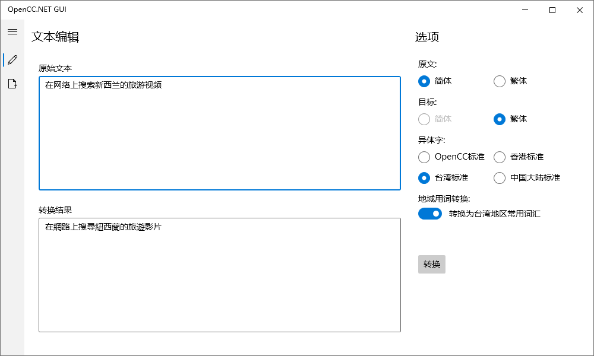
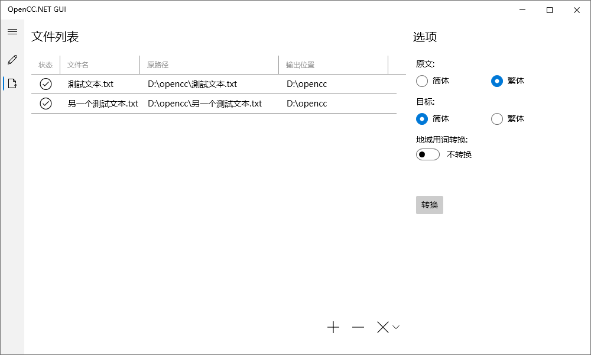

# OpenCC.NET GUI

## 介绍

OpenCC.NET GUI是基于OpenCC(Open Chinese Convert, 开放中文转换)，使用[OpenCC.NET](https://github.com/CosineG/OpenCC.NET)实现的中文转换工具，支持中文简繁体之间词汇级别的转换，同时还支持地域间异体字以及词汇的转换。

### 特点

- 支持简=>繁，繁=>简，繁=>繁的转换模式
- 支持包括OpenCC，中国大陆，台湾，香港四种异体字标准
- 支持中国大陆和台湾地区的常用词汇转换
- 支持txt文本文件的批量转换

## 开始

### 获取

可以直接在仓库页面右侧获取最新Release版本，或下载源码后自行编译。若无法运行，请确保安装了[.NET Core 3.1运行时](https://dotnet.microsoft.com/download/dotnet/thank-you/runtime-desktop-3.1.21-windows-x64-installer)。

### 使用

软件提供了文本编辑转换和文件批量转换两种功能。

#### 文本编辑转换

此模式下直接在文本框中输入你所需要转换的语句，在右侧选择转换选项后，点击转换按钮即可得到结果。

#### 文件批量转换

此模式下可以批量导入txt文本文件进行转换。若生成文件为乱码，请确保原文件为UTF-8编码。

## 引用

### OpenCC.NET

[OpenCC.NET](https://github.com/CosineG/OpenCC.NET)实现文本转换。

### OpenCC

[OpenCC](https://github.com/BYVoid/OpenCC)为OpenCC.NET提供词库。

### jieba.NET

[jieba.NET](https://github.com/anderscui/jieba.NET)为OpenCC.NET提供分词。

### ModernWpf

[ModernWpf](https://github.com/Kinnara/ModernWpf)提供UI控件。

### Ookii.Dialogs.Wpf

[Ookii.Dialogs.Wpf](https://github.com/ookii-dialogs/ookii-dialogs-wpf)提供选择文件夹窗口（没错，WPF没有自带选择文件夹窗口）。